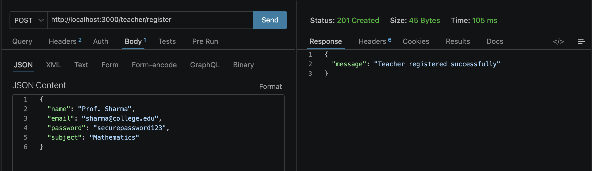
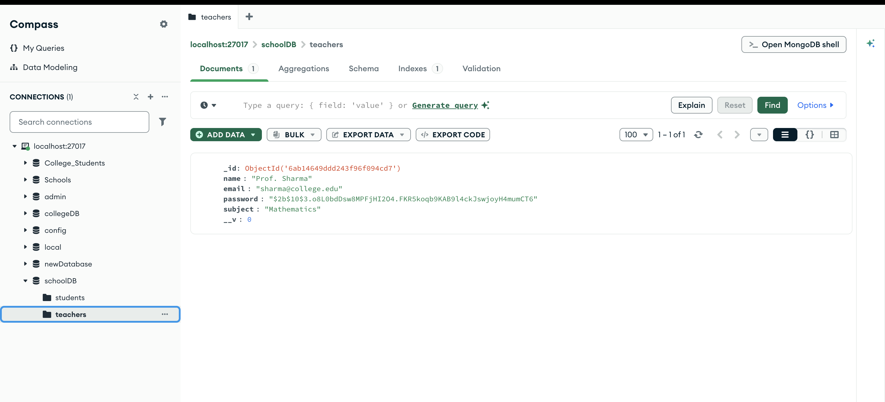
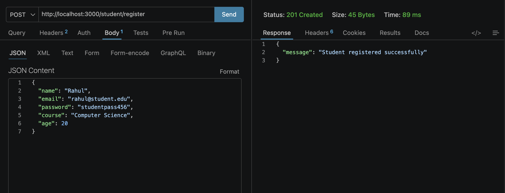

# Assignment 11: Teacher and Student Registration System

A robust Node.js and Express backend application demonstrating secure user registration. This project implements a modular architecture to separate concerns and utilizes industry-standard libraries for data validation and cryptographic security.

## 🛠️ Technology Stack
* **Framework:** Express.js
* **Database:** MongoDB (via Mongoose)
* **Validation:** Joi (Schema validation)
* **Security:** Bcrypt (Password hashing)

---

## 📂 1. Modular Project Architecture
**Objective:** Maintain a strict separation of concerns by isolating schemas, models, and routing logic for both Teacher and Student entities.
* `schema/`: Contains Mongoose schemas defining the exact shape of the database documents.
* `model/`: Wraps schemas into Mongoose Models for database interaction.
* `router/`: Contains Express routing logic, Joi validation rules, and Bcrypt hashing execution.

### Architecture Verification:

---

## 🔌 2. Database Connection
**Objective:** Successfully connect the Express application to a local MongoDB instance.

### Terminal Output:

---

## 🧑‍🏫 3. Teacher Registration API
**Endpoint:** `POST /teacher/register`

**Payload Requirements:**
* `name` (String, Required)
* `email` (String, Valid Email, Required)
* `password` (String, Min 6 chars, Required)
* `subject` (String, Required)

**Security Protocol:** The plain text password is intercepted, validated by Joi, and hashed via Bcrypt (salt rounds: 10) before reaching the database.

### API Testing (Thunder Client):

### Database Verification (MongoDB Compass):

---

## 🎓 4. Student Registration API
**Endpoint:** `POST /student/register`

**Payload Requirements:**
* `name` (String, Required)
* `email` (String, Valid Email, Required)
* `password` (String, Min 6 chars, Required)
* `course` (String, Required)
* `age` (Number, Required)

**Security Protocol:** Identical to the Teacher workflow, ensuring student credentials are encrypted at rest.

### API Testing (Thunder Client / Postman):

### Database Verification (MongoDB Compass):

