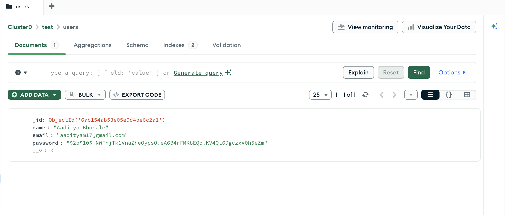
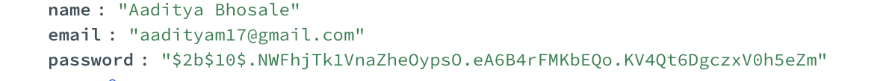
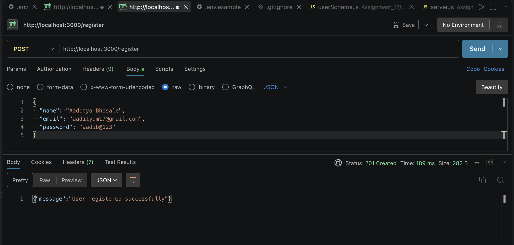
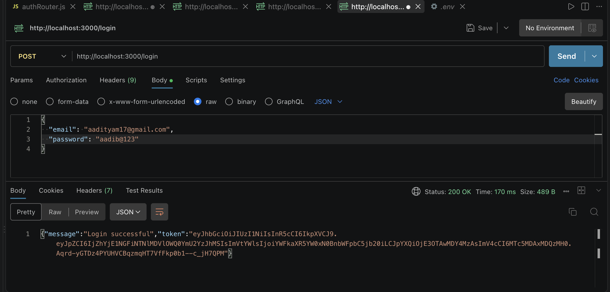
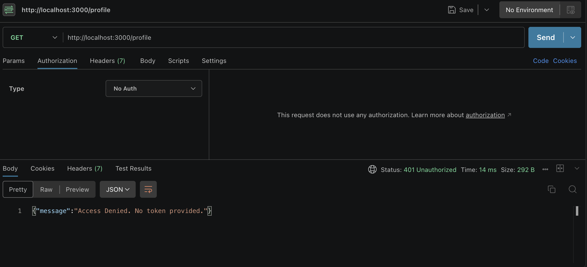
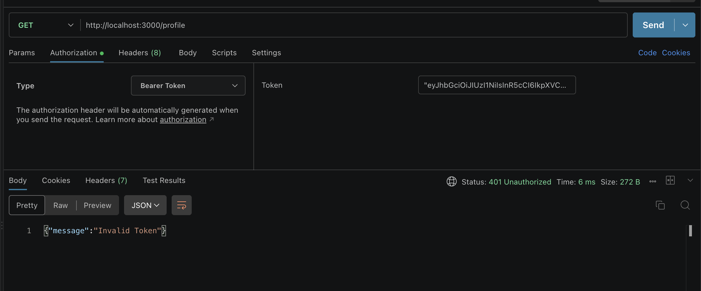
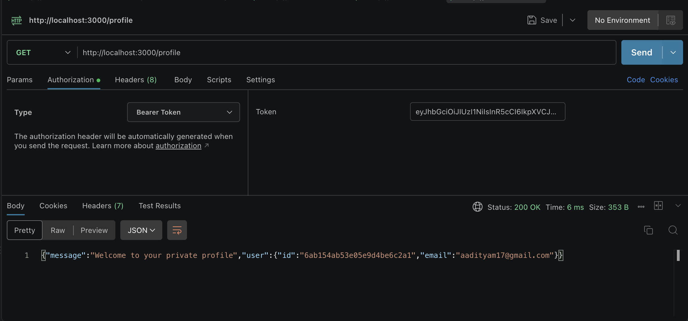

# Assignment 12: Secure User Authentication System

A comprehensive Node.js and Express backend demonstrating secure user registration, login, and protected routes using MongoDB Atlas, bcrypt, and JSON Web Tokens (JWT).

## 🗄️ Project Architecture & Deliverables
* **Node.js/Express Project:** Fully functional backend server.
* **Database:** MongoDB Atlas implementation using Mongoose.
* **Schema/Model:** `schema/userSchema.js`
* **Authentication Middleware:** `middleware/auth.js`
* **Routes:** `router/authRouter.js` (Register, Login, and Profile endpoints).
* **Environment Management:** `.env.example` and `.gitignore` configured to secure credentials.

## 📸 Testing & Verification Screenshots

### 1. Database Configuration
* **User Stored in MongoDB Atlas:** 

* **Hashed Password Visible in Atlas:** 

### 2. Registration API (`POST /register`)
* **Successful Registration in Postman:** 

### 3. Login API (`POST /login`)
* **Successful Login & JWT Token Received:** 

### 4. Private Profile API (`GET /profile`)
* **Access Without Token (Expected: 401 Unauthorized):** 

* **Access With Invalid Token (Expected: 401 Unauthorized):** 

* **Access With Valid Token (Expected: 200 OK):** 
