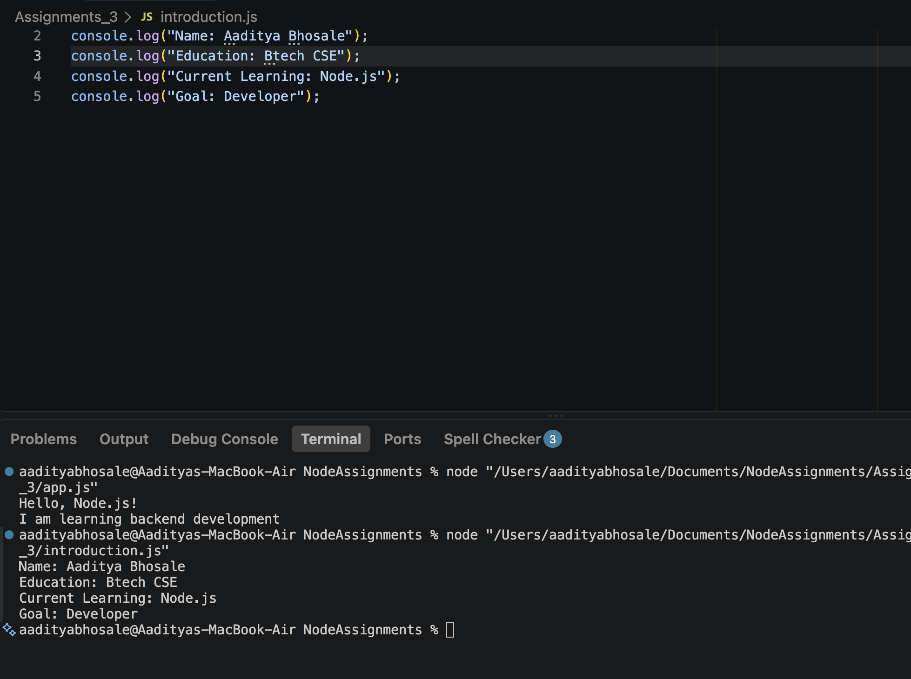

# NodeJS Basics Assignment

## Assignment Description
This project contains the first Node.js assignment. It includes a basic program to print messages to the terminal (`app.js`) and a simple personal introduction program (`introduction.js`).

## Steps to Run the Programs
1. Make sure Node.js is installed on your computer.
2. Open your terminal or command prompt.
3. Navigate to the `NodeJS-Basics-Assignment` folder.
4. Run the commands listed below to execute each file.

## Commands Used
* To run the first program: `node app.js`
* To run the introduction program: `node introduction.js`

