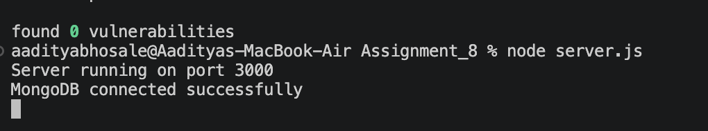
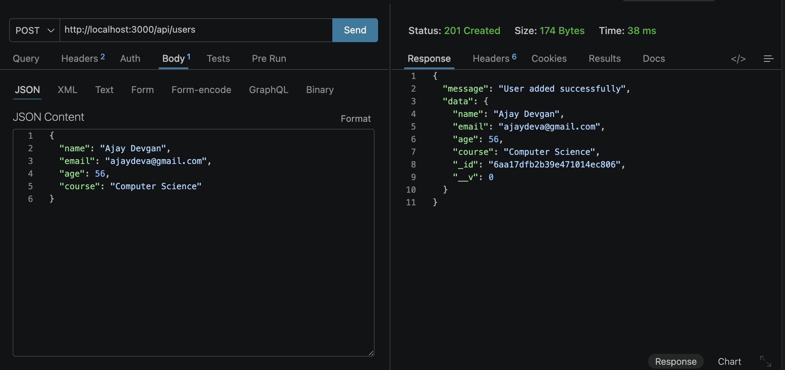
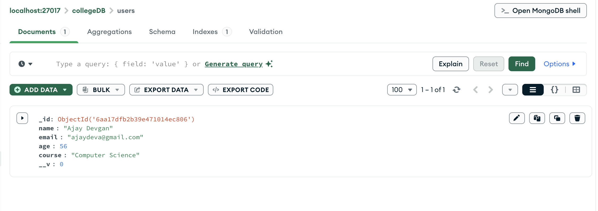
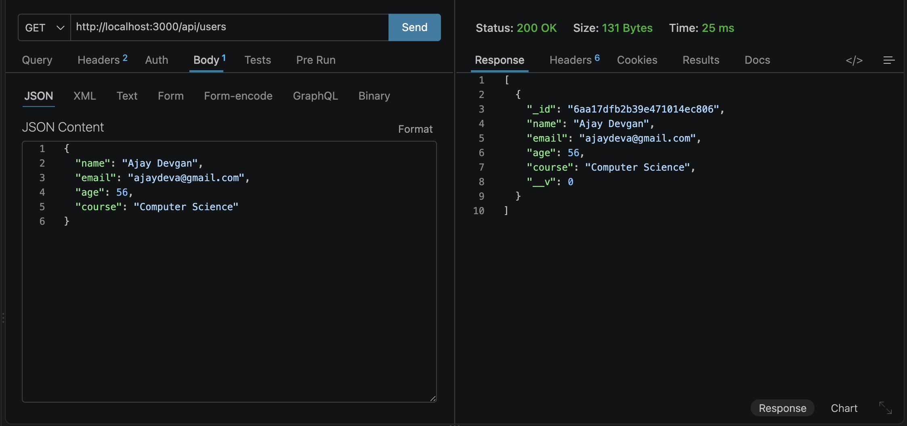
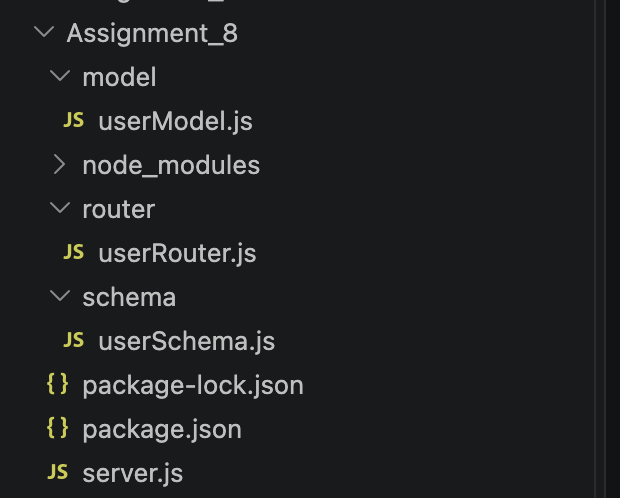

# Express, MongoDB, and Mongoose Integration

This repository demonstrates a backend connection using Express.js and MongoDB via the Mongoose library. It strictly follows a modular architecture by separating schemas, models, and routing logic into distinct directories.

## Setup and Execution
1. Ensure a local instance of MongoDB is running on your machine.
2. Navigate to this directory: `cd Assignment_8`
3. Install dependencies: `npm install express mongoose`
4. Start the server: `node server.js`
5. Test the `POST` and `GET` API endpoints using Thunder Client.

---

## 1. MongoDB Connection
**Objective:** Verify that the Express application successfully connects to the local MongoDB database instance (`collegeDB`).

### Terminal Output:

---

## 2. POST API (Create User)
**Objective:** Send a `POST` request to `/api/users` with a JSON payload to insert a new user document into the database.

### Thunder Client POST Response:

---

## 3. Database Verification
**Objective:** Visually confirm that the user data sent via the API is successfully stored within the MongoDB database.

### MongoDB Compass View:

---

## 4. GET API (Retrieve Users)
**Objective:** Send a `GET` request to `/api/users` to retrieve all stored user documents from the database in JSON format.

### Thunder Client GET Response:

---

## 5. Project Architecture
**Objective:** Demonstrate adherence to the required modular folder structure for schemas, models, routers, and the main server file.

### Folder Structure:
