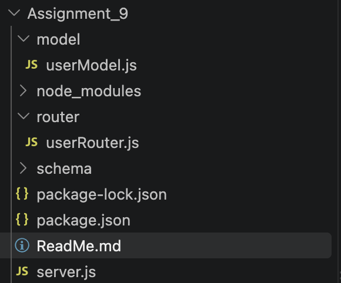
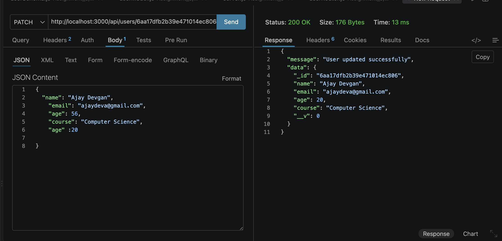
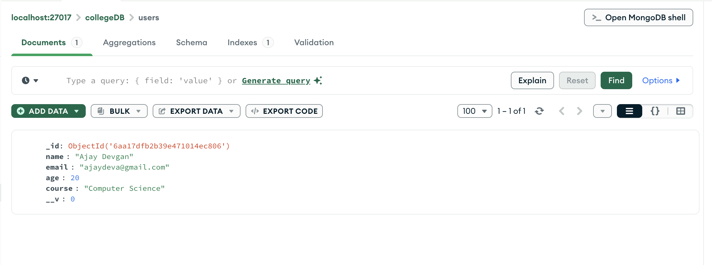
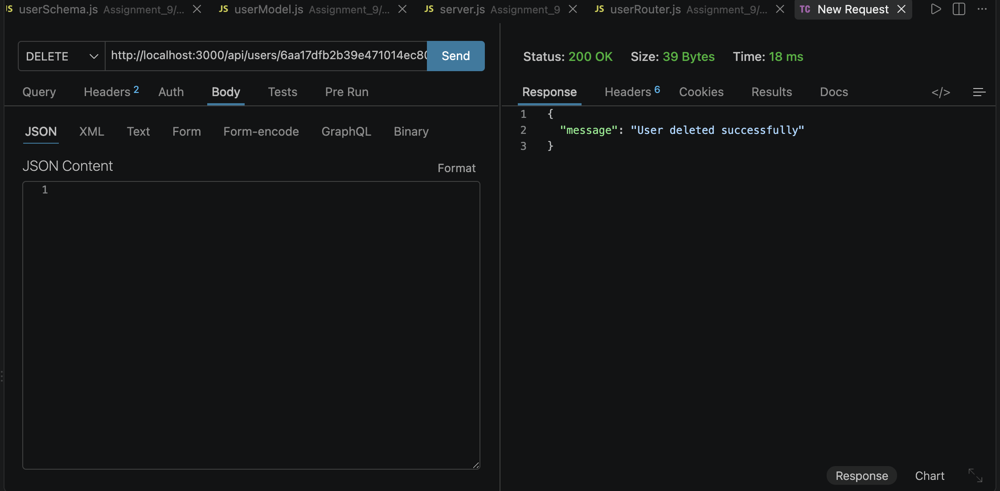
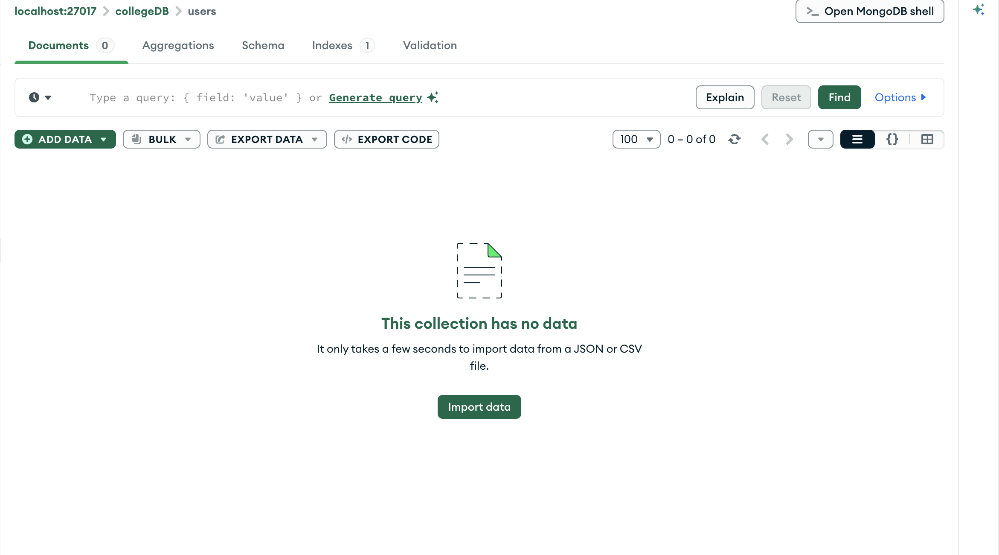
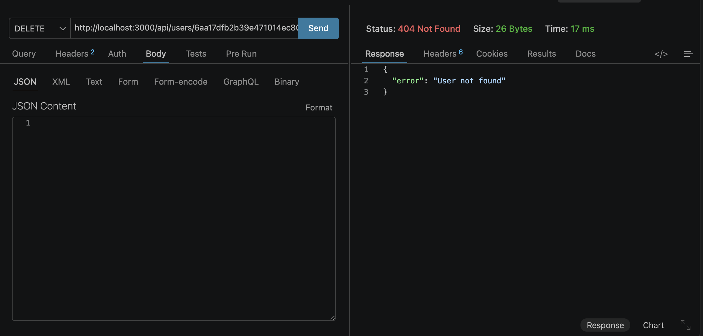

# Assignment 9: Update and Delete Users (MongoDB & Mongoose)

This repository extends the previous Express.js and MongoDB application to include **Update (PATCH)** and **Delete (DELETE)** operations. It continues to strictly follow a modular architecture by utilizing separate folders for schemas, models, and routing logic.

## Setup and Execution
1. Ensure a local instance of MongoDB is running.
2. Navigate to this directory: `cd Assignment_9`
3. Install dependencies: `npm install express mongoose`
4. Start the server: `node server.js`
5. Test the API endpoints using Thunder Client.

---

## 1. Project Architecture
**Objective:** Maintain the proper folder structure (`schema`, `model`, `router`, and `server.js`) and reuse the existing Mongoose schema and model without defining them directly in the server file.

### Folder Structure:

---

## 2. PATCH API (Update User)
**Objective:** Update an existing user's information in MongoDB by reading the ID from `req.params` and the updated data from `req.body`.

### Thunder Client PATCH Response:

### MongoDB Compass Verification (Updated Data):

---

## 3. DELETE API (Remove User)
**Objective:** Delete a specific user document from MongoDB by reading the ID from `req.params`.

### Thunder Client DELETE Response:

### MongoDB Compass Verification (Deleted Data):

---

## 4. Error Handling
**Objective:** Appropriately handle invalid MongoDB IDs and requests for users that do not exist (e.g., trying to delete a user that was already deleted).

### Thunder Client Error Response (404 User Not Found ):

